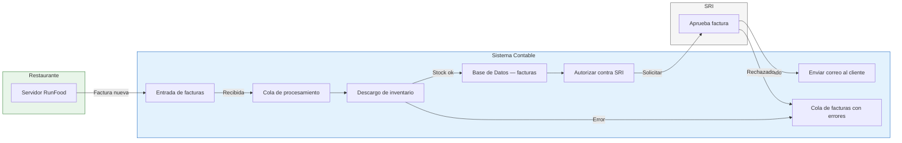
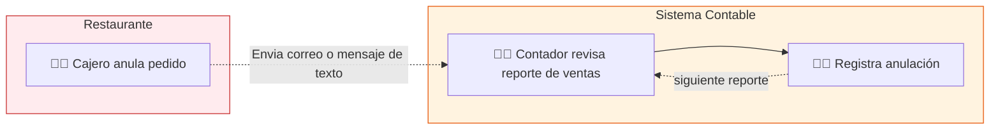
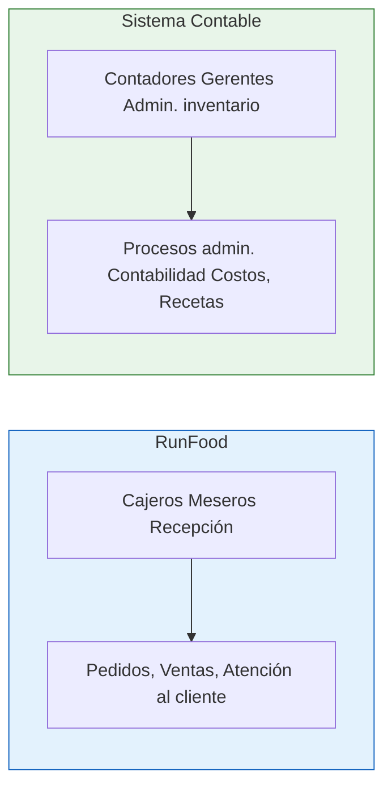
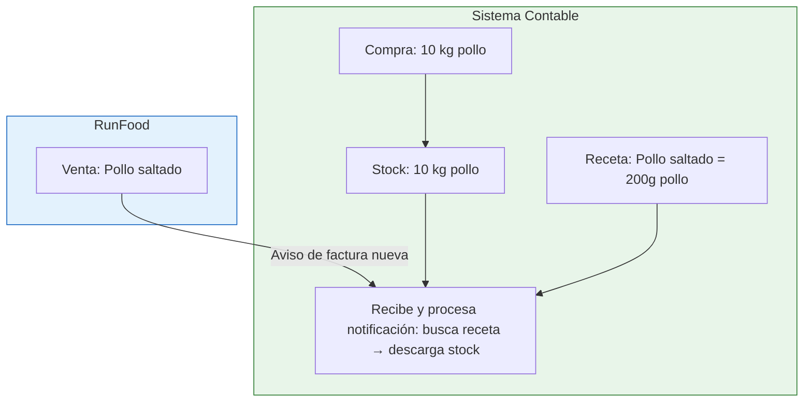
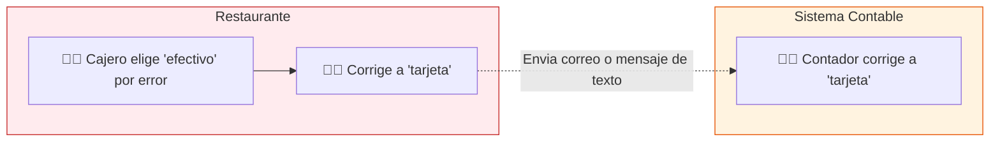

# Integración con Sistemas Contables

<small>Fecha de creación: 22 de Junio de 2026.</small><br/><small>Autor: Diego Paguay</small>

## 1. Introducción

Una empresa de contabilidad conecta su sistema con RunFood (punto de venta) para
recibir automáticamente las facturas electrónicas que emiten los restaurantes.

Elimina el ingreso manual de ventas: cuando el restaurante factura, la factura
llega sola al sistema contable. También cubre las anulaciones.

Va dirigido a la empresa de contabilidad, no al restaurante. El sistema contable
recibe los datos.

## 2. RunFood está en el restaurante

El servidor RunFood está **dentro del restaurante**, no en la nube. Depende de
la electricidad e internet del local. Puede no estar disponible en cualquier
momento.

Esto tiene dos consecuencias directas para el diseño:

- **El sistema contable depende de lo que RunFood le envíe.** No existe forma de
  consultar facturas pasadas. Si una factura no llegó, no se recupera.
- **RunFood solo avisa una vez.** No reintenta. Si el sistema contable no
  confirma la recepción, la factura se pierde.

La regla más importante de esta integración: **confirmar la recepción siempre,
inmediatamente, antes de procesar.** El procesamiento va a una cola interna.

## 3. Flujo principal: Factura creada (automático)

RunFood envía la factura. El sistema contable la recibe, la autoriza contra el
SRI, y envía el comprobante al cliente por correo.



### Flujo

1. RunFood envía la factura. El sistema contable confirma la recepción de
   inmediato.
2. La factura entra a una cola de procesamiento.
3. Se descarga inventario de los productos vendidos.
4. Si algo falla (producto no encontrado) → va a la cola de errores.
5. Si todo está bien → se guarda en la base de datos.
6. El sistema contable envía la factura al SRI para autorización.
7. Si el SRI la rechaza → va a la cola de errores.
8. Si el SRI la aprueba → el sistema contable envía el correo al cliente.

### Inventario: la factura ya existe

El aviso llega **después** de emitida la factura. Ninguna validación de stock
puede impedir la factura. Si al descargar el stock un producto queda negativo,
la factura se procesa y se encola una alerta de inventario.

El problema no es la factura — el problema es que el producto no está en el
catálogo del sistema contable, o la receta tiene cantidades incorrectas. La
factura es correcta, lo que falla es la configuración de los productos.

## 4. Flujo secundario: Anulación de factura (manual)

RunFood no avisa al sistema contable. El contador detecta la anulación por su
cuenta.



Cada sistema resuelve lo suyo: cajero anula para que cuadre la caja; contador
registra la anulación cuando la detecta.

## 5. Sólo 1 sistema por tipo de usuario



> Cuantas menos acciones tenga que hacer el usuario, mejor. Un usuario debería
> manejar solo un sistema, no dos o más.

El usuario se equivoca menos cuando aprende un solo sistema. Sabe a quién
consultar. Los roles de TI son la excepción.

## 6. Decisiones de diseño

### 6.1 Inventario y recetas en el sistema contable



El sistema contable gestiona el inventario y las recetas porque las compras ya
se registran allí.

**Ejemplo:** Se compran "10 kg de pollo" → quedan en stock del sistema contable.
RunFood no sabe cuánto pollo hay. Se configura la receta "Pollo saltado = 200g
pollo". Cuando RunFood vende un Pollo saltado, la notificación llega al sistema
contable, que busca la receta y descarga 200g del stock. RunFood solo ve el
plato, no los ingredientes.

### 6.2 Autorización SRI y correo al cliente

RunFood emite la factura, pero el sistema contable la autoriza contra el SRI y
envía el correo al cliente. ¿Por qué?

**Un solo sistema para el contador.** El contador ve todo el ciclo desde el
mismo lugar: la factura llegó, fue autorizada, el cliente recibió el correo. Si
RunFood hiciera la autorización, el contador tendría que revisar dos sistemas
para saber el estado.

**Errores centralizados.** Si el SRI rechaza la factura, el contador la
encuentra en la cola de errores del sistema contable y la resuelve. Si RunFood
autorizara, el error llegaría al cajero, que no sabe qué hacer con un rechazo
del SRI. La cadena de comunicación (cajero → administrador → contador) es más
lenta y propensa a errores.

**El restaurante no se detiene.** El cajero sigue vendiendo. Si el SRI falla, el
problema lo gestiona el contador desde su sistema, sin interrumpir la operación
del restaurante.

### 6.3 Cambios en método de pago

Si el cajero elige un método de pago equivocado (ej. "efectivo" en vez de
"tarjeta"), RunFood no avisa al sistema contable. La corrección se hace por
separado.



RunFood **no avisa** al sistema contable cuando se corrige el método de pago. El
ajuste se hace por separado:

- En **RunFood**: el cajero corrige para que cuadre la caja.
- En el **sistema contable**: el contador corrige en la contabilidad para
  reportes financieros.

---

**A partir de aquí es contenido técnico.** Si eres vendedor o cliente, lo
anterior es suficiente para entender la integración. Lo que sigue es para
programadores y personal técnico.

---

## 7. Prerrequisitos técnicos

**Nota:** Salta al punto #8 si no eres programador o técnico.

Antes de conectar un cliente, el sistema contable necesita:

- Una **dirección pública en internet** donde RunFood enviará las notificaciones
  (ej. `https://micontable.com/webhooks/runfood`)
- El **RUC y razón social** del restaurante (para asociar la llave de conexión
  al cliente correcto)
- El **dueño del restaurante** debe autorizar la conexión por correo a RunFood

## 8. Guía de conexión

Para conectar un restaurante nuevo al sistema contable:

```
1. Dueño autoriza por correo → RunFood genera llave de conexión para ese cliente
       ↓
2. GET /identity — obtener RUC y razón social del local
       ↓
3. GET /products — obtener catálogo de productos
       ↓
4. GET /payment-methods — obtener formas de pago
       ↓
5. POST /webhooks — suscribirse a INVOICE.CREATED
       ↓
6. A partir de aquí las facturas llegan solas
```

## 9. Apéndice: Detalles técnicos

### 9.1 ¿Qué es un webhook?

Un **webhook** es una notificación automática que un sistema envía a otro cuando
ocurre un evento. En esta integración:

1. RunFood detecta que se emitió una factura.
2. RunFood envía un mensaje HTTP a la dirección del sistema contable.
3. El sistema contable responde con un código HTTP.
4. Si el código es **200** o **201**, RunFood entiende que la factura llegó bien
   y no la reenvía.
5. Si el código es **error (4xx o 5xx)**, RunFood **no** reintenta. La factura
   se pierde.

Por eso la regla más importante: **responder 200 siempre, inmediatamente, antes
de procesar.** El procesamiento va a una cola interna.

### 9.2 Códigos de respuesta HTTP

| Código               | Significado                | Qué pasa                              |
| -------------------- | -------------------------- | ------------------------------------- |
| `200 OK`             | Recibido correctamente     | RunFood da la factura por entregada   |
| `4xx` (ej. 400, 404) | Error del sistema contable | RunFood no reintenta, factura perdida |
| `5xx` (ej. 500)      | Error del servidor         | RunFood no reintenta, factura perdida |

Siempre responder `200` aunque después el procesamiento interno falle. El error
interno se maneja en la cola de errores del sistema contable.

### 9.3 Notificaciones disponibles

| Evento            | Cuándo ocurre                    |
| ----------------- | -------------------------------- |
| `INVOICE.CREATED` | Se emite una factura electrónica |

No existe notificación para anulación ni para cambios en la venta.

### 9.4 Consulta de datos

| Endpoint               | Descripción                                                     |
| ---------------------- | --------------------------------------------------------------- |
| `GET /identity`        | RUC, razón social, nombre comercial, ciudad del establecimiento |
| `GET /products`        | Lista de productos: nombre, código (SKU), precio                |
| `GET /products/{sku}`  | Detalles del producto (línea, nombre, categoría, etc.)          |
| `GET /payment-methods` | Métodos de pago configurados en el restaurante                  |

### 9.5 Gestión de notificaciones

| Endpoint                | Descripción                                               |
| ----------------------- | --------------------------------------------------------- |
| `POST /webhooks`        | Registrar suscripción a un evento (ej. `INVOICE.CREATED`) |
| `GET /webhooks`         | Listar suscripciones activas                              |
| `DELETE /webhooks/{id}` | Eliminar una suscripción                                  |

Para más información véase el
[API de RunFood](https://runfoodapp.github.io/api-docs).

### 9.6 Limitaciones conocidas

- No existe forma de consultar **facturas del pasado**. Toda factura llega
  exclusivamente por notificación automática (webhook).
- No existe notificación para anulación de factura. Si se anula un pedido en
  RunFood, el sistema contable no recibe aviso.
